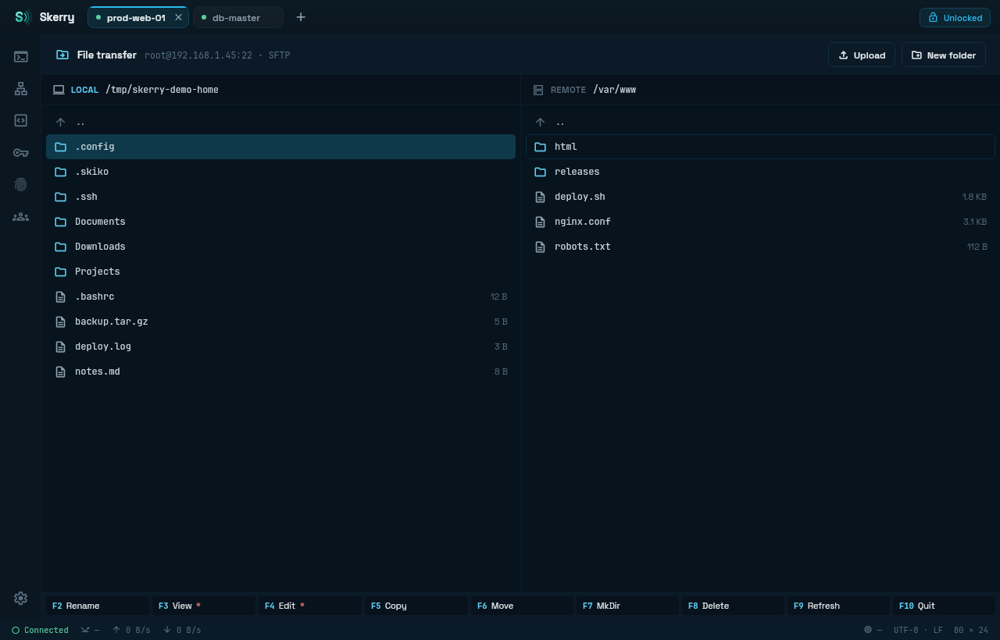
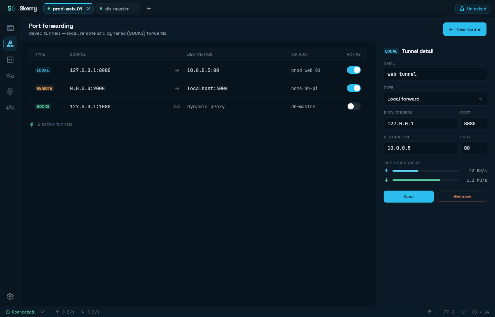
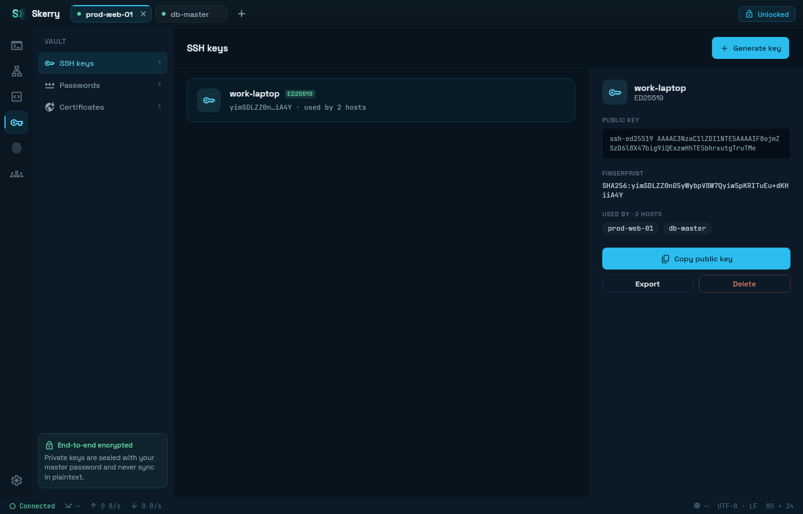
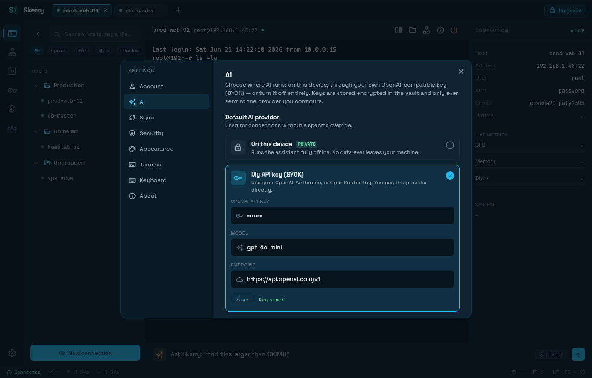
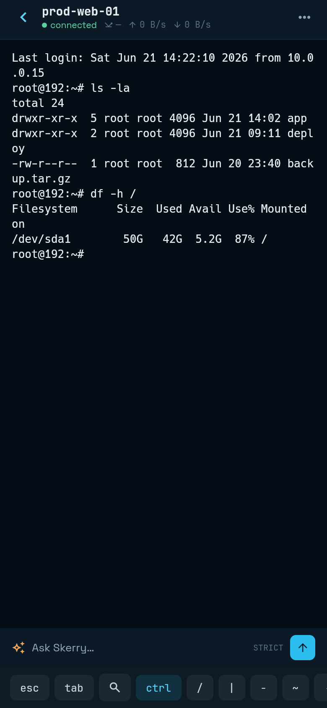

# Skerry

[English](README.md) · **Русский**

[](https://github.com/SeCherkasov/Skerry/actions/workflows/ci.yml)
[](LICENSE)
[](server/LICENSE)

Опенсорсный кроссплатформенный SSH-клиент с единым ядром: Kotlin Multiplatform под капотом,
Compose Multiplatform UI сверху. Один код ядра и один UI на **Desktop (Linux, Windows)**
и **Android**, паритет фич между платформами.

Версия — `0.1.0` (до первого релиза).

## Статус

В активной разработке под **Linux**, **Windows** и **Android**. **macOS** и **iOS/iPadOS**
— в планах.

## Скриншоты










| Список хостов | Терминал |
|---|---|
|  |  |

## Возможности

**Подключения**
- SSH (sshj + BouncyCastle), SSH-сертификаты
- SFTP (двухпанельный commander)
- Port forwarding: local (`-L`), remote (`-R`), dynamic/SOCKS (`-D`)
- Telnet (свой кодек IAC-неготиации), serial (jSerialComm на desktop; USB-OTG на Android:
  CDC/FTDI/CP210x/CH34x)

**Терминал**
- Своя grid-эмуляция: VT line-drawing, Unicode/combining, SGR, OSC 8/4/52/104,
  bracketed paste
- Вкладки со split view, авто-реконнект SSH, drag-reorder, живые метрики хоста (RTT)
- Рендеринг JetBrains Mono, reverse-search по scrollback

**Vault**
- XChaCha20-Poly1305, zero-knowledge: мастер-пароль не покидает устройство
- Биометрическая разблокировка (BiometricPrompt) с reset/recovery, `FLAG_SECURE` на Android
- Ключи, пароли, identities, сертификаты

**Sync (self-hosted, опционально)**
- Zero-knowledge синхронизация: разделение authKey/dataKey, XChaCha20-Poly1305 для данных,
  аутентификация SRP-6a (сервер хранит verifier, а не пароль), JWT-сессии
- Live-sync: push-on-change через WebSocket, tombstone-propagation, персист курсора,
  селективный синк по типам записей
- Паринг устройств по QR (ZXing + CameraX + ML Kit, on-device), админ-консоль
- См. раздел [Sync-сервер](#sync-сервер) ниже

**Teams (шеринг, опционально)**
- E2E zero-knowledge шеринг хостов и сниппетов внутри команды поверх sealed-envelope
  приглашений; роли owner/member, ACL-отзыв

**Сниппеты и AI**
- Библиотека команд со snippet type-ahead в терминале
- AI-ассистент (BYOK OpenAI, per-host политики Strict/Balanced/Permissive/Off) с SSE-стримингом
- Локальный AI на устройстве: приложение само качает GGUF-модели и запускает их через
  llama.cpp (каталог: Qwen3, Phi-4 Mini) — Strict-политика работает полностью офлайн

**Локализация**
- Строки в compose-resources (`composeApp/src/commonMain/composeResources/values*`);
  переключатель языка (`LocalAppLocale`) для UI и языка ответов AI-ассистента (INFO/ASK)

## Технологии

- **Язык/UI**: Kotlin 2.x, Compose Multiplatform 1.11.1
- **Сборка**: Gradle 9.3.1, Android Gradle Plugin 9.0.1
- **JVM-таргет**: JDK 21 (`jvmToolchain(21)` во всех модулях, `JVM_21`)
- **Android**: minSdk 26 (Android 8.0), compileSdk/targetSdk 36
- **Ядро**: sshj 0.40.0, BouncyCastle 1.80.2, libsodium (ionspin KMP), okio, atomicfu
- **Serial**: jSerialComm 2.11.0 (desktop), usb-serial-for-android 3.9.0 (Android, jitpack)
- **Sync**: Ktor 3.4.3 (клиент+сервер), Exposed 0.58.0, SQLite/PostgreSQL, HikariCP,
  Nimbus SRP-6a

## Структура репозитория

```
shared/       # ядро KMP: ssh/, sftp/, vault/, sync/, team/, terminal/, ai/ (+ai/local),
              # telnet/, serial/, tunnel/, snippet/, host/, files/
composeApp/   # UI (Compose Multiplatform): commonMain + androidMain + desktopMain
androidApp/   # Android-приложение (MainActivity, манифест); applicationId app.skerry
server/       # self-hosted sync-сервер (Ktor, AGPL-3.0)
sync-wire/    # wire-контракт, общий для клиента и сервера
docs/         # HTML-прототипы (источник правды по UX) и дизайн-документы
```

HTML-прототипы в `docs/design/` (`Skerry Tablet.html`, `Skerry Logo.html`) — источник правды
по UI, реализуется 1:1.

## Сборка

Нужен **JDK 21** (`foojay-resolver` при необходимости подтянет сам). Для Android дополнительно
нужен Android SDK (`ANDROID_HOME`).

Desktop:

```bash
./gradlew :composeApp:run                                # запуск
./gradlew :composeApp:packageDistributionForCurrentOS    # .deb / .rpm / .msi / .dmg
```

ProGuard/минификация для desktop-релиза отключена намеренно — она ломала крипто-стек;
см. комментарий в `composeApp/build.gradle.kts`.

Android:

```bash
ANDROID_HOME=$HOME/Android/Sdk ./gradlew :androidApp:installDebug
```

Тесты (JUnit 5):

```bash
./gradlew test
```

Релизы: пуш тега `v*` запускает release-workflow, который собирает `.deb`/`.rpm`/`.msi`,
подписанный `.apk` и `SHA256SUMS` и публикует их как draft GitHub Release.

## Sync-сервер

Skerry — local-first: приложение полностью работает без сервера. Когда vault нужен на
нескольких устройствах, вы поднимаете **свой** sync-сервер; вендорского облака нет.

Сервер zero-knowledge по построению: он хранит только шифротекст (обёрнутый `dataKey`,
зашифрованные записи vault) и метаданные синхронизации. Аутентификация — SRP-6a: сам пароль
никогда не передаётся, и расшифровать ваши данные сервер не может.

Быстрый старт (один контейнер, SQLite в именованном томе — нулевая настройка):

```bash
export SKERRY_JWT_SECRET="$(openssl rand -base64 48)"    # обязательно: с дефолтом сервер не стартует
export SKERRY_ADMIN_TOKEN="$(openssl rand -hex 16)"      # опционально: включает дашборд /console
docker compose up -d --build
```

Сервер слушает `http://localhost:8080` и несёт встроенную, полностью офлайновую
админ-консоль на `/console`. Для PostgreSQL раскомментируйте сервис `db` и
postgres-переменные в [docker-compose.yml](docker-compose.yml). Сборка только сервера не
требует Android SDK: `./gradlew :server:run -PserverOnly`.

Полный гид по развёртыванию — справочник конфигурации, API-эндпоинты, TLS-терминация
(Caddy/nginx), бэкапы и модель приватности — в
**[server/README.md](server/README.md)** ([RU](server/README.ru.md)).

## Принципы

- **Local-first** — всё работает без сервера.
- **Zero-knowledge** — мастер-пароль не покидает устройство.
- **AI under policy** — вывод модели считается недоверенным; действия только после
  подтверждения.
- **Паритет платформ** — фича не готова, пока не работает везде.

## Лицензии

- Клиенты (`shared/`, `composeApp/`, `androidApp/`) — [GPL-3.0](LICENSE)
- Sync-сервер (`server/`) — [AGPL-3.0](server/LICENSE)
